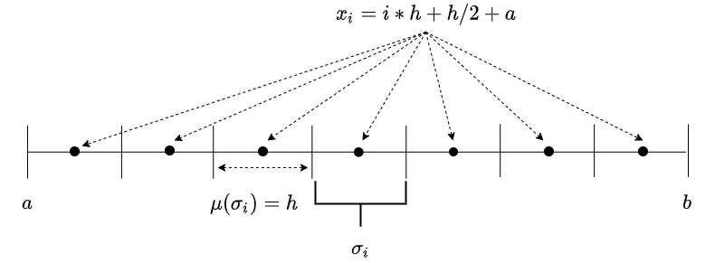

## Постановка задачи

Дано интегральное уравнение Фредгольма 2-го рода с вырожденным ядром в общем виде:

$$
    \alpha(x) \cdot u(x) + \lambda \cdot \int_{\Omega} K(x, y) \cdot u(y) dy = f(x),
$$
где $K(x,y)$ -- известное ядро интегрального уравнения (известная функция интегрального оператора); $\alpha(x)$ -- известная функция при неизвестном $u(x)$, входящая в уравнение линейно; $f(x)$ -- известная неоднородная часть или внешнее возмущение (известная внешняя функция); $\lambda$ -- константа интегрального оператора; $u(x)$ -- искомая функция (решение интегрального уравнения)

Пусть,

- $K(x,y) = x \cdot y$, 

- $\alpha(x) = 1$,

- $f(x) = x$,

- $\lambda = 1$,

- $\Omega \in \mathbf{R}\ [a, b],\  a = 0,\  b = 1$.

Тогда в соответствии с данной постановкой перепишем уравнение в следующем виде:

$$
     u(x) + \int_{0}^{1} x \cdot y \cdot u(y) dy = x, \ \ \ (*)
$$
исходя из которого мы сможем найти неизвестную функцию $u(x)$ как аналитически, так и численно.

## Задание

1. Решить поставленное интегральное уравнение (*) аналитически, применив метод решения интегрального уравнения с вырожденным ядром [1].

2. Решить данное уравнение численно с числом неизвестных $N = 3$ с помощью метода кусочно-постоянных аппроксимаций и коллокаций по следующему принципу:

$$
    x_i = i \cdot h + \frac{h}{2} + a;\ \ \;h = \frac{|b - a|}{N}\ \ \  i = 0, \dots, N-1;\ \ \ N = 3
$$

$$
    \int_a^b u(y) dy = \sum_{i = 0}^{N - 1} u(y_i) \cdot \mu(\sigma_i)
$$

$$
    u(x_i) + \sum_{i = 0}^{N - 1} K(x_i, y_j) \cdot u(y_j) \mu(\sigma_j) = f(x_i);\ \ \  i = 0, \dots, N-1
$$

3. Сравнить численный и аналитический результаты по метрике относительной ошибки:

$$
    \delta = \frac{\sum_{i=0}^{N-1} ||u(x_i) - u_i||}{\sum_{i=0}^{N-1} ||u(x_i)||}
$$