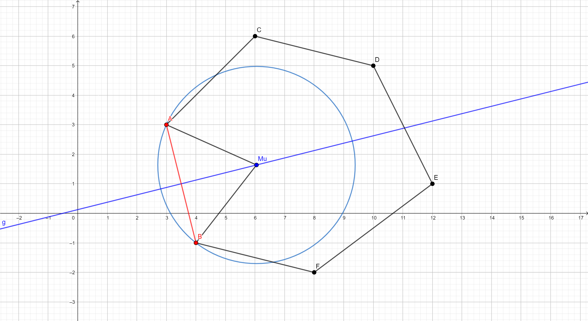
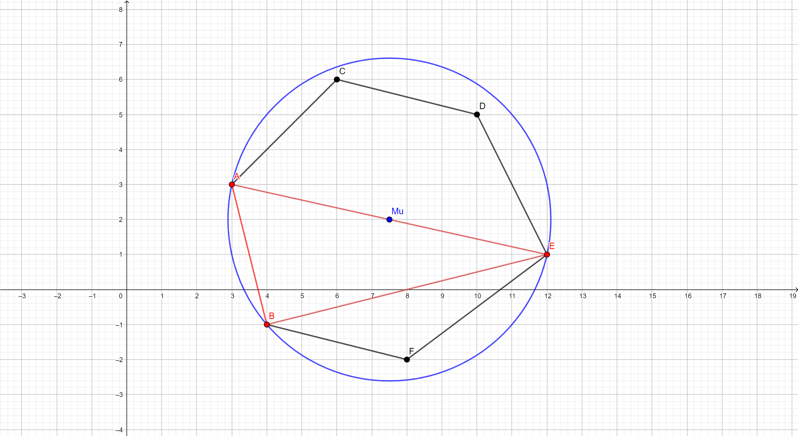

## Обобщенный метод простой итерации

Пусть поставлена задача решения СЛАУ вида:

$$
    A u = f,
$$
$$
    A = (a_{ij}); \ \ \ i = {1, 2 \dots, N}; \ \ \ j = {1, 2 \dots, N},
$$
$$
    u = (u_1, u_2, \dots, u_N),\ \ \ f = (f_1, f_2, \dots, f_N),
$$
где $A$ -- матрица СЛАУ с размерностью $N^2$ и $\forall a_{ij} \in A: a_{ij} \in \mathbf{C}, (i, j) = 0, 1, \dots, N-1$ (в общем случае данная матрица порождена исходя из дискретизации физической задачи и является матрицей линейного оператора); $f: \forall f_i \in \mathbf{C}$ -- вектор свободных членов, заданный, прежде всего исходя из дискретизации неоднородной части уравнения $f(x)$ при дискретизации задачи. Вектор $u: \forall u_i \in \mathbf{C}$ -- численные значения неизвестной функции $u(x)$ непрерывной постановки задачи операторного уравнения. 

Апроирно известно разположение спектра матрицы оператора $A$ для изначальной постановки физической задачи из функциональных свойств оператора уравнения. Тогда в связи с этим обстоятельством рекомендуется воспользоваться алгоритмом поиска итерационного параметра по точкам границы спектра оператора из алгоритма обобщенного метода простой итерации.

Итерационный процесс для обобщенного метода простой итерации выглядит следующим образом:

$$
    u_{k+1} = u_{k} - \frac{1}{\mu} \left( A \cdot u_k - f \right),
$$
где $u_k$ -- приближаемое значение неизвестного вектора $u$ из СЛАУ на $k$-ом шаге итерационного процесса; $\mu$ -- итерационный параметр обобщенного метода простой итерации (центр окружности в комплексной плоскости, описанной около спектра оператора $A$, видимой из начала координат под наименьшим углом).

Норма $$||x|| = \sqrt{(x, x)},$$ что для комплексных величин определено как:

$$
    (x, y) = \sum_{i = 0}^{N - 1} x_i \cdot \overline{y_j}
$$

Критерий останова для итерационного метода выглядит следующим образом:

$$
    \frac{||u_{k+1} - u_k||}{||f||} < \varepsilon,\ \forall \varepsilon \in \mathbf{R} (0, 0.1)
$$

## Поиск итерационного параметра по известной границе спектра оператора

В заданной выше итерационной процедуре итерационный процесс описан полностью за исключением процесса поиска итерационного параметра полученного алгоритма.

**Ограничения на оператор $A$**: Спектр оператора $A$ не должен пересекать начало координат. В противном случае итерационная процедура не сойдется к решению.

**Ограничения на задачу поиска параметра**: Поиск параметра подразумевает поиск окружности минимальной по величине радиуса (пары: центр $\mu$, радиус $R$), описывающей известную границу спектра оператора $A$.

Простыми словами, задается переборный алгоритм поиска окружности описывающей все точки спектра оператора по парам и тройкам точек известной границы спектра. 

### Алгоритм:

Дан $\lambda = (\lambda_1, \lambda_2, \dots, \lambda_m)$ -- набор точек известной границы спектра оператора $A$, где $m$ -- число точек на границе. 

1. По всем точкам границы спектра оператора делаем перебор пар $(\lambda_i, \lambda_j), i\ne j$ с поиском $\mu$ и $R$ по следующим формулам:

$$
    \mu_0 = \frac{\lambda_1 + \lambda_2}{2} + \frac{1i \cdot Im(\lambda_1 \cdot \overline{\lambda_2}) \cdot (\lambda_2 - \lambda_1)}{2 \cdot (|\lambda_1 \cdot \overline{\lambda_2}| + Re(\lambda_1 \cdot \overline{\lambda_2}))}
$$

$$
    R = \sqrt{\frac{|\lambda_1 - \lambda_2|^2 \cdot |\overline{\lambda_1} \cdot \lambda_2|}{2\cdot (|\overline{\lambda_1} \cdot \lambda_2| + Re(\overline{\lambda_1} \cdot \lambda_2))}}
$$

2. Если в переборе пар $$(\lambda_i, \lambda_j), i\ne j$$ находится окружность с центром $\mu$ и радиусом $R$, которые покрывают весь спектр оператора, то поиск прекращается и выводится параметр $\mu$. Если в переборе пар такой окржности не находится, то алгоритм продолжается

3. Производится перебор троек границы спектра $(\lambda_i, \lambda_j, \lambda_k), i \ne j, j\ne k, k \ne i$. По формулам вычисляем центр $\mu$ и радиус окружности $R$:

$$
    \mu_0 = 1i\cdot \frac{|\lambda_1|^2 \cdot (\lambda_2 - \lambda_3) + |\lambda_2|^2 \cdot (\lambda_3 - \lambda_1) + |\lambda_3|^2 \cdot (\lambda_1 - \lambda_2)}{2 \cdot Im(\lambda_1 \cdot \overline{\lambda_2} + \lambda_2 \cdot \overline{\lambda_3} + \lambda_3 \cdot \overline{\lambda_1})}
$$

$$
    R = |\mu_0 - \lambda_1|
$$

4. Среди найденных окружностей находим окружность с минимальным радиусом или с минимальным углом обзора из начала координат

## Рекомендации

1. Вычисления умножений матриц на вектор при каждой итерации в итерационных методах решения СЛАУ являются самыми ресурсоемкими со сложностью (в худшем случае) пропорциональной $O(N^2)$, в результате чего следует данные операции стараться производить максимально меньшее число раз с сохранением в памяти их результатов для сокращения к минимуму накладных расходов на итерационный метод и приравниванию скорости решения к теоретически заявленной.

2. Подсчёт итераций итерационного метода стоит производить пропорционально самой ресурсоемкой операции при произведении вычислений. В результате чего, итерационные методы сравниваются по количеству умножений матрицы на вектор в результате релизации метода при решении задач.

3. Алгоритм поиска спектрального итерационного параметра может оказаться ресурсоемкой процедурой в случае поиска на большом множестве параметров. Стоит подумать над более оптимальным алгоритмом

## Задание

1. Задать диагональную матрицу $(a_{ij}) \in A: \forall a_{ij} \in \mathbf{C}$ 

$$
    a_{ij} = \begin{matrix} \alpha_i + i \cdot \beta_i; \ \  i = j; \ i, j = 1, 2, \dots , N \\
                            0; \ \ \ \ \ \ \ \ \ \ \ \ \ \ \ \ i\ne j; \ i, j = 1, 2, \dots , N  \end{matrix}
$$

и вектор $f$:

$$
    f = i, \ \ i = 1, 2, \dots, N
$$

2. Реализовать на любом языке программирования обобщенный метод простой итерации и протестировать его на решении задачи №1.
